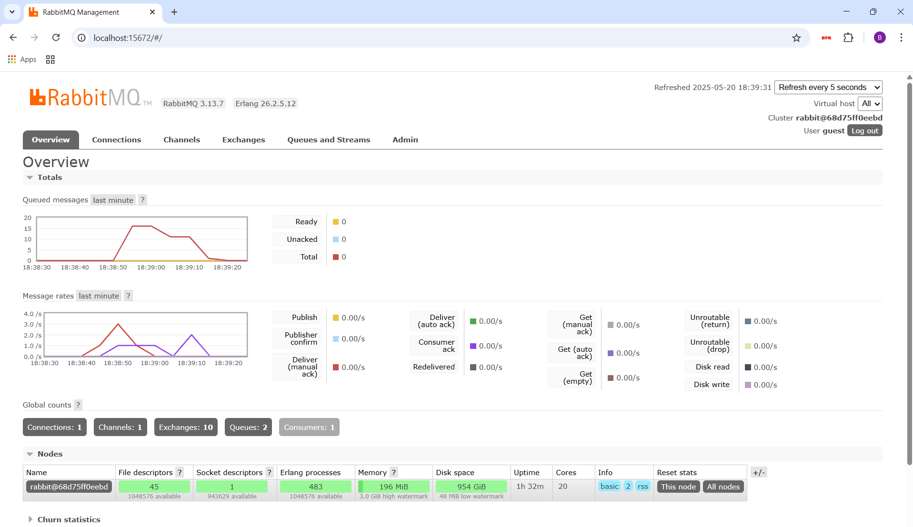
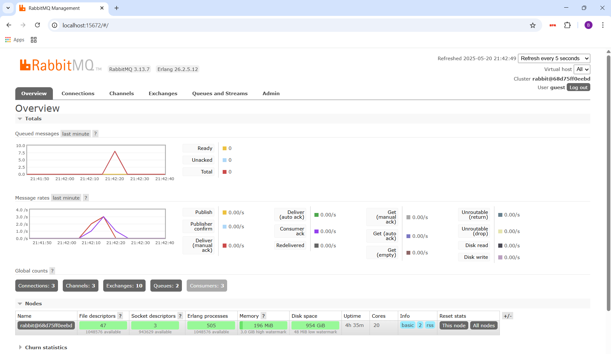

# Module 9 - Subscriber
## Question 7
a.  
AMQP (Advanced Message Queuing Protocol) is an open-standard messaging protocol that enabled applications and systems to communicate via a message broker. It is designed to be a reliable, asynchronous, and secure method of exchanging messages between systems. This protocol also ensures that messages are delivered even in the case of network or system failures.

b.  
The first `guest` is the username used to authenticate with the AMQP broker. The second `guest` is the password for authentication. However, these are both default credentials, and should not be used in actual production.

The `localhost` is the host address where the AMQP broker is running. `localhost` refers to the local machine and translates to `127.0.0.1`. `5672` is the default port number used for unencrypted AMQP connections. For encrypted connections with SSL/TLS, the port is `5671` instead.

## RabbitMQ screenshot for slow subscriber

In this case, I ran the publisher app five times (in total, 25 messages are sent). The total number of queued messages in my case is 15. Only 10 messages can be processed at once in the broker, so the rest of messages goes into the queue and waits until the messages have already been processed.

## RabbitMQ screenshot for three subscribers

In this case, I ran three instances of the subscriber app, and still ran the publisher app five times. This time, the total number of queued messages reduced drastically from 15 to 8 because of more instances being able to read the broker. It also took a shorter time for all the messages to be processed.

As for the improvements that can be done to the subscriber code, it is best to change `loop {}` to a proper wait mechanism to prevent 100% CPU usage.
